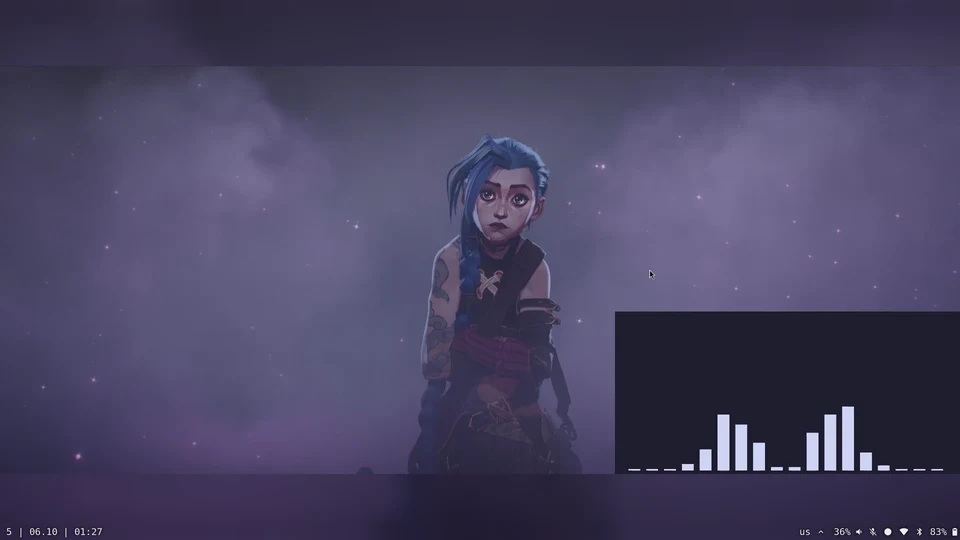

# hyprmosaic

A Hyprland plugin that gives every workspace its own wallpaper, drawn as part of the workspace, so it slides along with it. It works with any workspace setup. Out of the box it also turns workspaces 1–9 into a 3x3 grid you swipe through in both directions.



Other wallpaper tools draw one background behind every workspace and swap it after a switch. hyprmosaic draws each wallpaper with its workspace, so mid-swipe you see half of each one. That works with hyprmosaic's grid swipes, Hyprland's built-in workspace swipe, and keyboard switching.

## Install

```sh
hyprpm add https://github.com/La5u/hyprmosaic
hyprpm enable hyprmosaic
```

Load it at startup:

```lua
-- hyprland.lua
hl.on("hyprland.start", function()
    hl.exec_cmd("hyprpm reload -n")
end)
```

```ini
# hyprland.conf
exec-once = hyprpm reload -n
```

## Wallpapers

Workspace `N` uses the image at `~/.local/state/hyprmosaic/N` (or `$XDG_STATE_HOME/hyprmosaic/N`). It can be the image itself or a symlink to one, and any workspace number works. PNG, JPEG, WebP, AVIF, JPEG XL, BMP and SVG are supported. Changes are picked up immediately.

```sh
ln -sf ~/Pictures/arcane.png ~/.local/state/hyprmosaic/5
```

Workspaces without an image show your normal wallpaper or `misc:background_color`.

### From a wallpaper picker

Any picker that can run a command after you choose an image works. Link the image to the active workspace:

```sh
ln -sf "$IMAGE" ~/.local/state/hyprmosaic/$(hyprctl activeworkspace -j | jq .id)
```

For example, in Waypaper's `~/.config/waypaper/config.ini`:

```ini
backend = none
post_command = ln -sf $wallpaper ~/.local/state/hyprmosaic/$(hyprctl activeworkspace -j | jq .id)
```

Waypaper won't start unless some wallpaper backend is installed, even with `backend = none`. Install a small one such as `swaybg`; it's never run.

## Workspace layouts

**3x3 grid (default).** Workspaces 1–9, swiped with three fingers. Each swipe moves one column or one row and stops at the edges:

```
1 2 3
4 5 6
7 8 9
```

**Any other grid.** Set `columns` and `rows`. Workspaces `1` to `columns × rows` are laid out row by row, for example 4x2:

```lua
hl.config({ plugin = { hyprmosaic = { columns = 4, rows = 2 } } })
```

**A single row.** Set `rows = 1` and swipe left and right through workspaces `1` to `columns`.

**Your own setup.** Set `fingers = 0` to turn hyprmosaic's swipes off and keep only the wallpapers. Switch workspaces however you already do: keybinds, Hyprland's own `workspace` gesture, Waybar or anything else. Any workspace number can have a wallpaper.

```lua
hl.config({ plugin = { hyprmosaic = { fingers = 0 } } })
```

## Options

| option | default | |
|---|---|---|
| `columns` | `3` | grid columns, 1–10 |
| `rows` | `3` | grid rows, 1–10 |
| `fingers` | `3` | fingers for grid swipes, `0` to disable them |
| `blur_fill` | `true` | fill around an image with a blurred copy of it, instead of `misc:background_color` |

Set them in `hyprland.lua`, or as `plugin:hyprmosaic:<option>` in `hyprland.conf`:

```lua
hl.config({ plugin = { hyprmosaic = { blur_fill = false } } })
```

```ini
plugin:hyprmosaic:blur_fill = false
```

Images are fitted whole. Swipes follow Hyprland's `gestures:workspace_swipe_distance`, `workspace_swipe_invert`, `workspace_swipe_cancel_ratio` and `workspace_swipe_min_speed_to_force`.

## Limitations

- Animated wallpapers (GIF, video) aren't supported.
- Images are decoded on the compositor thread, so loading a large one can cause a brief stutter.
- Editing an image file in place isn't detected; re-link it instead.
- Rotated monitors and the `fade`/`slidefade` workspace animations aren't handled.

## Credits

The swipe commit/cancel logic is adapted from Hyprland's `UnifiedWorkspaceSwipeGesture` (BSD-3-Clause, © vaxerski). Inspired by [jairnarvaez/Hyprgrid](https://github.com/jairnarvaez/Hyprgrid).

## License

MIT. See [LICENSE](LICENSE), which also contains Hyprland's BSD-3 notice.
